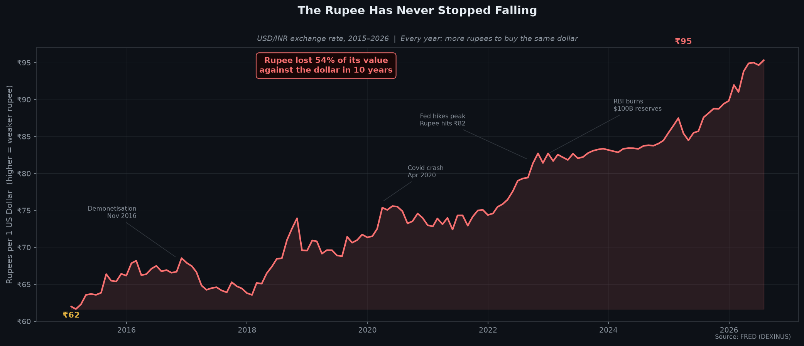
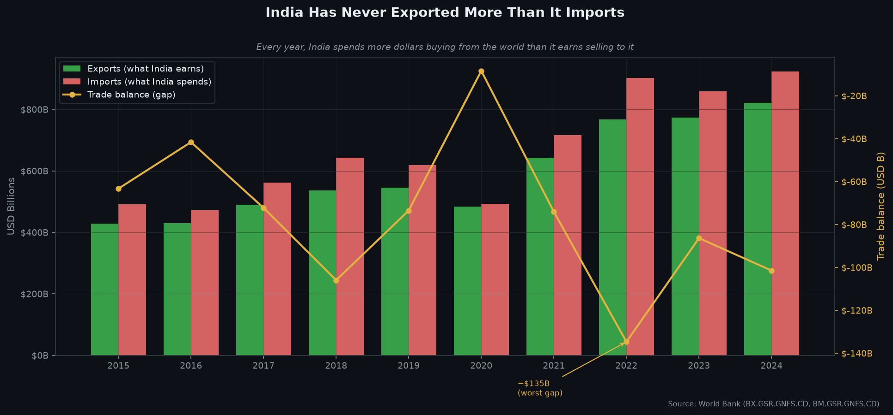
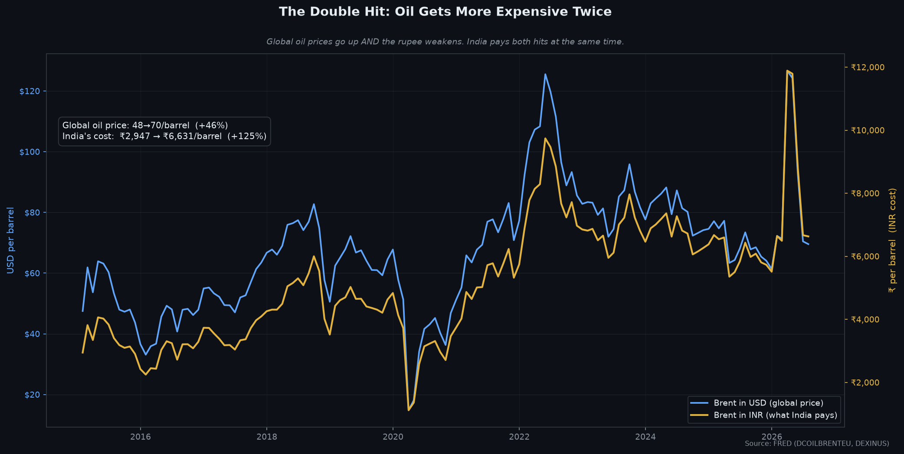
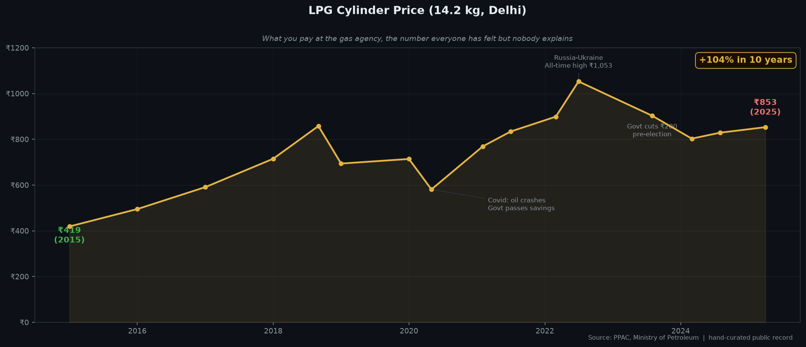

# Why Is Everything Getting More Expensive in India When the Headlines Say the Economy Is Doing Great?

*I'm not an economist. I'm a CS student who started pulling data.*

---

Last year my mom mentioned our LPG bill had gone up again. I didn't think much of it, everything goes up, right? But then I started noticing a pattern. Petrol prices rising. LPG rising. Gold prices rising. The rupee at ₹85, now ₹95 to a dollar. And at some point the Prime Minister himself was telling people to cut back on gold and foreign spending, while the government quietly started taxing both.

And every few months, some news channel is celebrating India becoming the 5th largest economy. GDP growing at 7–9%. "India is the fastest growing major economy."

I kept thinking, okay, but why does it feel like everything is getting more expensive then? Why is the government telling people not to buy gold? Why is the rupee going down every year?

I didn't have an answer so I just started pulling numbers.

---

## Start with the rupee

I started here because it's the one number that's hard to argue with.

In 2015, ₹63 bought you 1 US dollar. Today it takes ₹95. That's a 54% drop in 10 years, and the line has never gone back up. Not after demonetisation. Not after Covid. Not during any of the "fastest growing major economy" years.

The reason I trust this number more than most is that the currency market isn't a government report. It's just millions of people trading real money. And that line has been going one direction for 10 years straight.

---

## So why is the rupee falling?

This took me a while to piece together.

India earns dollars mainly from IT exports, pharma, and remittances from Indians working abroad. And India spends dollars on things it can't really stop importing: **oil, gold, and electronics**, all priced in dollars.

Every year India spends more dollars than it earns. I knew this vaguely but didn't really get it until I looked at the actual trade numbers.

The green bars are exports (what India earns), red bars are imports (what India spends). The green bar has never once been taller than the red bar. Not in 2015, not in 2020, not in 2024. In 2022 the gap was $135 billion in a single year.

So where does the shortfall come from? Foreign investors putting money into India, foreign companies building factories here, Indians sending money home from abroad. That covers it most years. But that money isn't fixed, it moves around based on what's happening globally.

---

## What happened in 2022

In 2022 the US Federal Reserve started raising interest rates aggressively to deal with their own inflation. Rates went from near 0% to over 5% in about 18 months.

I had to think about what that actually means for India. If you're a foreign investor and you can get 5% risk-free in US government bonds, why would you keep money in Indian stocks or bonds? So a lot of that money left India.

When foreign investors pull money out, they sell rupees to buy dollars. More rupees in circulation, fewer dollars coming in, rupee gets weaker.

This is the part that actually surprised me. When the rupee weakens, everything India imports gets more expensive in rupees, even if the global price didn't change. So on oil, India gets hit twice.

Global oil went from around $48 to $70 per barrel over this period, a 46% increase in dollar terms. But India's cost in rupees went from ₹2,947 to ₹6,631 per barrel, 125% increase. The extra hit is just from the rupee falling. So when people say "but global oil prices have come down," that's true in dollars. India buys oil in rupees.

---

## The LPG number

I wanted one number that makes all of this feel real, something everyone has actually noticed.

A 14.2 kg LPG cylinder cost ₹419 in 2015. Today it costs ₹853. More than double. Official inflation over the same period has averaged around 5% per year.

If inflation is 5%, why did the gas cylinder double?

LPG is a petroleum byproduct so its price follows global oil prices, and then the rupee/dollar rate affects what it actually costs in India. Both went the wrong way.

The biggest drop was in 2020, when Covid collapsed global oil demand. The government passed on some of that. But once oil recovered, prices came back up faster than they went down.

Also, there's a ₹200 cut in August 2023 and prices start creeping back up a few months after that. I'm not saying anything, I'll just leave that there.

---

## Gold and the travel tax

This is where it started clicking for me.

India imports hundreds of tonnes of gold a year. Gold is priced in dollars. So every time someone in India buys gold, dollars are leaving the country, which makes the trade gap worse and puts more pressure on the rupee.

The government raised the gold import duty from 10% in 2015 to effectively 18.45% by 2022. So people were being taxed for buying the thing they've traditionally bought to protect themselves when the currency weakens. That's a bit of a strange position to be in.

The 20% TCS on international credit card spending introduced in 2023 is the same thing. Rupees spent abroad are dollars leaving India, so the government added a cost to slow it down.

I used to think these were unrelated policy decisions. They're not. They're all responses to the same underlying problem of India needing more dollars than it earns.

---

## The stock market

I'm less sure about this part so take it with that in mind.

For a lot of retail investors who entered during 2020–2021, the Nifty has been roughly flat or negative since then. Part of that is foreign investors (FIIs) selling Indian stocks when they pulled money out to move it to the US. That dragged prices down.

But even if the number looks flat, inflation at 5–6% per year means the actual value of that investment is going down. And in dollar terms it's even worse because the rupee fell too.

I'm not a trader so I don't know where it goes from here. I just know a few people who invested around 2020–2021 and are confused why their portfolio is flat or down, and I think this is a big part of why.

---

## But GDP really is growing, right?

I kept second-guessing myself on this because I didn't want to write something that's just complaining.

The GDP growth is real, the number isn't fabricated. But GDP is the total size of the economy, it doesn't tell you who got what or whether the average person felt it. From what I read, a lot of the growth is from government infrastructure spending, IT exports (strong, but doesn't employ that many people directly), and spending by people who are already doing well.

None of that is fake. But it's also not the same as the average household noticing the economy is doing well. The LPG cylinder, petrol prices, the rupee, those are also real. They just don't show up in the GDP number.

I don't have a clean way to reconcile those two things. I think that's kind of the point.

---

## What I took away

The way I started thinking about it: the rupee is like a log file that the market writes every day. And for 10 years it's been logging the same warning: India spends more dollars than it earns, and the gap is covered by foreign money that moves based on what the US economy is doing.

When that money exits, the rupee falls, oil and LPG get more expensive in rupees, and the government responds by taxing gold and international spending.

I'm not saying India's economy is failing. I just wanted to understand why the gas cylinder at home doubled in price while every headline was saying the economy was doing great. Turns out you can have both happening at the same time, they're just measuring different things.

---

*Next I'm looking at why India's official inflation number and what businesses actually pay for goods have been telling completely different stories. That gap is bigger than most people realize.*

---

*Data from FRED (Federal Reserve Economic Data), World Bank Open Data, and PPAC (Petroleum Planning & Analysis Cell), Ministry of Petroleum. Charts generated from raw CSVs. No numbers adjusted manually.*

*If I got something wrong I'd genuinely like to know. Drop a comment.*
